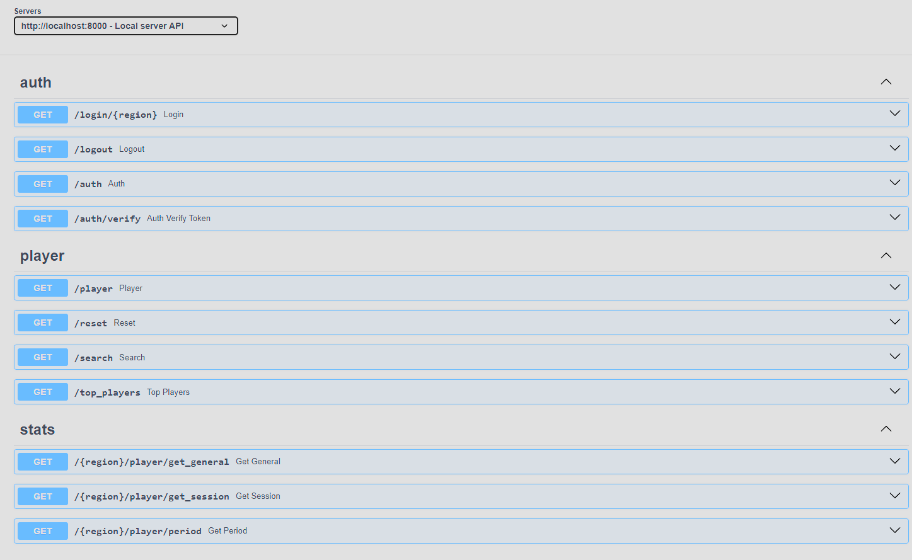
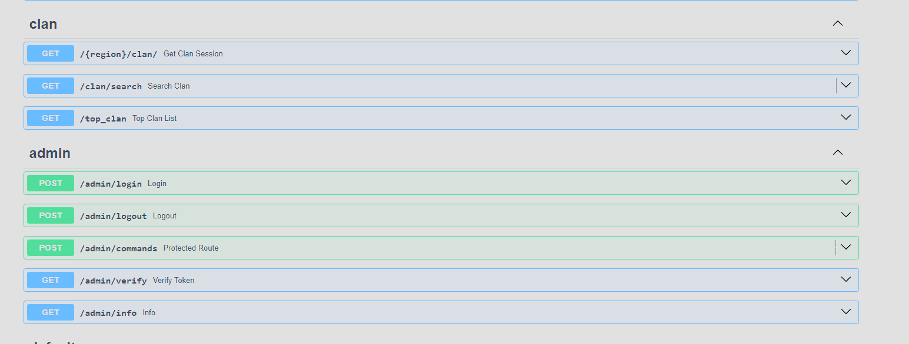
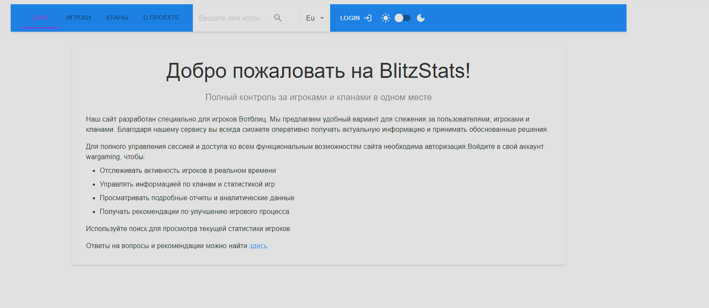
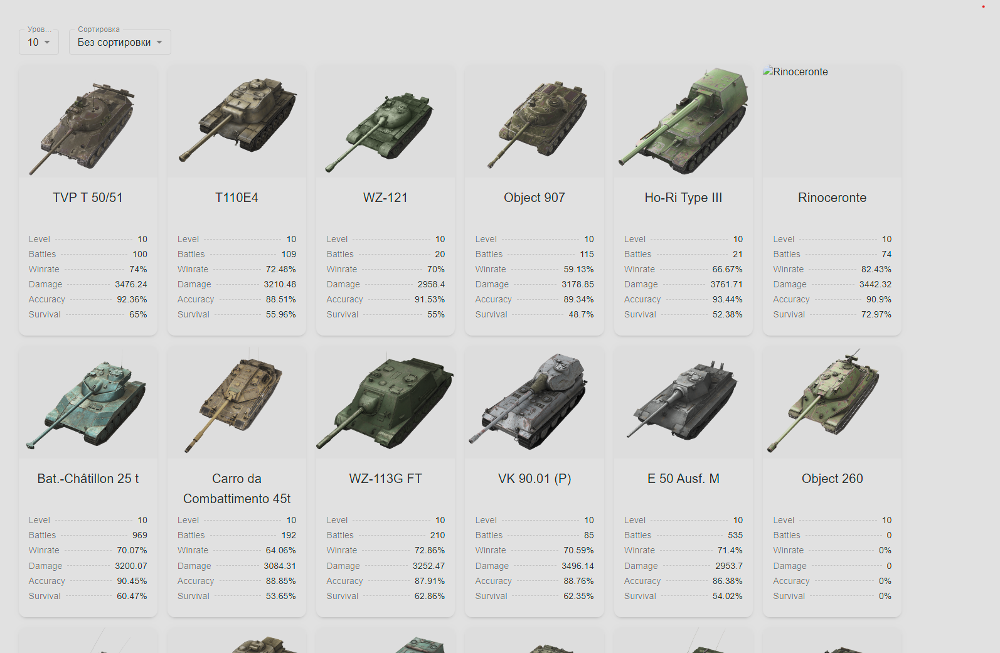
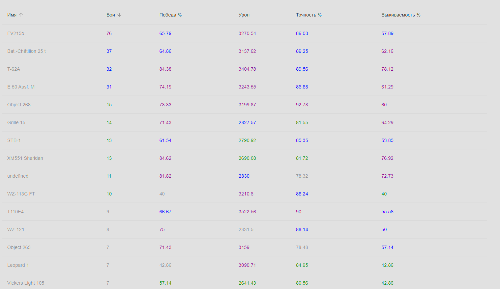
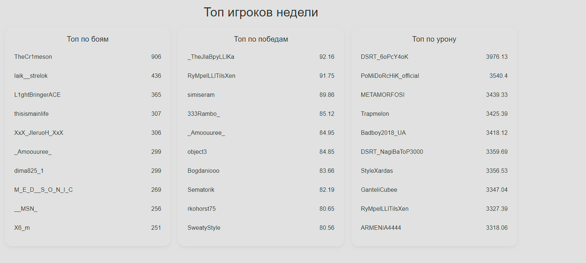
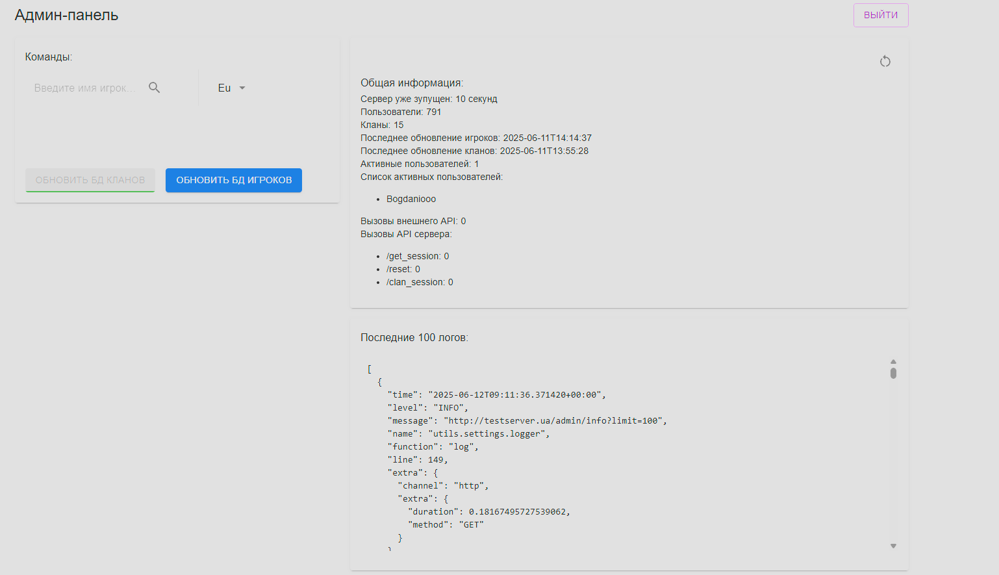
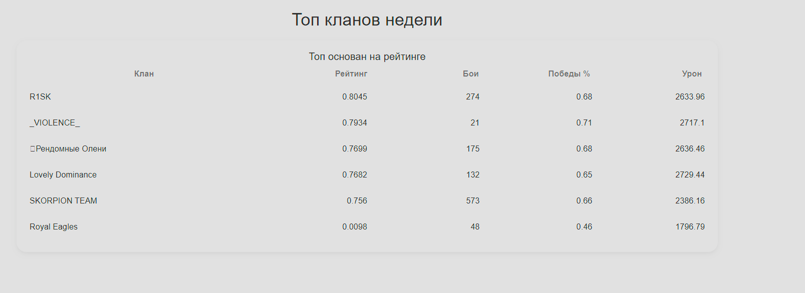

# Данный проект поможет отслеживать сессии игроков мирового шутера World of Tanks Blitz

### Для запуска проекта локально необходимо:
- создать приложение [тут](https://developers.wargaming.net/)
- установить poetry если не установлен 
- установить redis
- установить MongoDB
- создать .env файл такого [типа](./docker/.env.example)

- запустить сервер командой
``` sh
poetry install --only main --no-root
python -m scripts.init_db
uvicorn utils.server.app:app --host 0.0.0.0 --port 8000 --no-access-log
```
### Для запуска проекта в docker необходимо:
- создать приложение [тут](https://developers.wargaming.net/)
- создать .env файл такого [типа](./docker/.env.example)

- запустить сервер командой
``` sh
docker-compose -f docker\docker-compose.yaml up -d
```

### Функциональность 
1. Сбрасывать сессию может только авторизованый игрок который прошел OAuth 2.0 через ручку /login
2. Отображение главных показателей на текущий момент
4. Отображение сессии игрока от начала reset 
5. Отображение сессии игрока от начала reset через websocket для автомитического получения актуальных данных (каждую минуту)
6. Отображение сессий игроков за определенный период кратно 1 дню
7. Каждый день идет обновление бд для игроков чтобы отображать данные за определенный период
8. Каждую неделю идет обновление бд для кланов 
9. Рейтинг игроков за период и по параметру
10. Рейтинг кланов за период, показатель рейтинга расчитываеться по формуле 
11. Какую статистику отображает рандомные бои, рейтинговые бои, увиличение медалей, рандомные бои по танкам, изменение приватных полей (только для авторизированные игроков)
12. У админа есть ряд команд: 
- сбросить сесиию у определенного игрока или клана
- обновить бд игроков или кланов до или после события по росписанию
- также для админа вывод информационных данных о состояние сервера
- сбор метркик приложения

### Frontend
Фронтед можно посмотреть [здесь](https://github.com/xaker00UA/Frontend-wotblitz)
### Внешний вид







